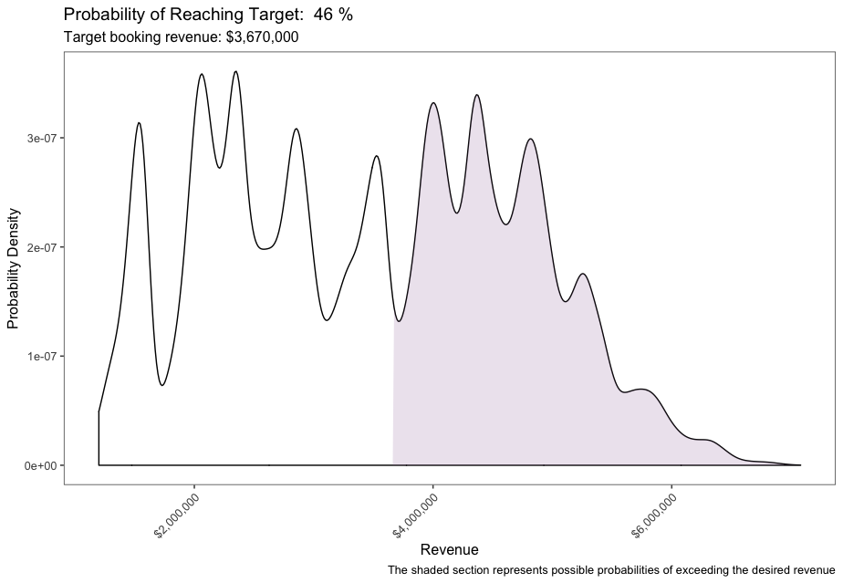

# Salesian
This repo attempts to model a basket of events that have a probability of occurring and a probability of value if the event manifests. For example a "basket of deals" in a sales pipeline, where each deal can be expressed as occuring within a timeframe as a probability, and a low- and high-side estimate of the deal's value should it occur. The main question it attempts to answer is how likely the entire basket is to meet or exceed some target revenue number. The application was build with a sales pipeline in mind, but non-profit donor rolls could also be modeled.

Several deals can be declared, all in a rectangular data frame that looks like:

|name   | revenue_lo| rev_lo_prob| revenue_hi| rev_hi_prob| booking_mean| booking_var|
|:------|----------:|-----------:|----------:|-----------:|------------:|-----------:|
|Deal 1 |    1200000|       0.200|    1440000|       0.800|         1.00|        0.00|
|Deal 2 |     900000|       0.400|    1080000|       0.600|         0.20|        0.10|
|Deal 3 |     800000|       0.900|     960000|       0.100|         0.50|        0.10|
|Deal 4 |     400000|       0.300|     480000|       0.700|         0.20|        0.05|
|Deal 5 |    2000000|       0.700|    2400000|       0.300|         0.50|        0.10|
|Deal 6 |     500000|       0.600|     600000|       0.400|         0.45|        0.01|
|Deal 7 |     100000|       0.334|     120000|       0.666|         0.70|        0.10|

Each deal has

* name: a unique identifier
* revenue_lo: the low-side of the deal's value, as a numeric
* rev_lo_prob: the low-side's probability of occuring, as a decimal 0 <= x <= 1
* revenue_hi: the high-side of the deal's value, as a numeric
* rev_hi_prob: the high-sides's probability of occuring; must be 1-rev_lo_prob
* booking_mean: the mean probability of the deal manifesting
* booking_var: the variance around the booking mean

In words, if a Deal is expressible as: "Deal 2 will land at either $900,000 or $1,080,000 with a 40/60 percent probability and an overall probability of 20% +/- 10% of occuring within some time-frame", then it can be modeled with this tool. If that time-frame has a target goal (e.g. $3,670,000), then this tool attempts to assign a probability that the basket will result in meeting or exceeding that goal.

The tool performs simulations over the entire basket and generates plots that look like the lead image up above, which shows a density plot of all possible revenue amounts (based on the simulations) and determines the proportion of the amounts that meet or exceed the target. 

# Technical Details

## Execution
To run this, you can use R and RStudio. The simplest way to do it is to type `shiny::runGitHub("salesian", username="schnee")` (but you'll have to ensure you have all the packages installed - see server.R to get them). Doing this will run the Shiny-based web app, in which you can upload a CSV, define a target and simulate

OR

You can use the `Dockerfile` to build an image and then `docker run` that image (exposing port 3838). You can even host the image on, for example, AWS or other cloud provider than can host images. A local docker approach might look like:

```
docker build --no-cache -t salesian_app .
docker run --name=salesian_app --user shiny --rm -p 80:3838 salesian_app
```

Either way, [this spreadsheet on Google](https://docs.google.com/spreadsheets/d/1kNbJVZURMRdG6WAOzxrXuZ3-J6iYaF0q1e3Gi3U2qEk/edit?usp=sharing) can be copied, modified, exported as a CSV, and then uploaded. I didn't read directly from Google because a) Google caches things and b) I was too lazy to use something like `googlesheets4`. 


## Implementation

The web app is all in R and, more specifically, Shiny.

The simulation is several "draws" from a Bernoulli distribution wrapped around the Beta function (for the booking probability) and a simple uniform two-sided random function for the revenue's low and high. The Bernoulli-wrapped-Beta returns {0,1} which is multiplied by the revenue.